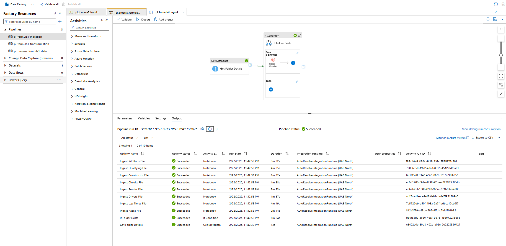
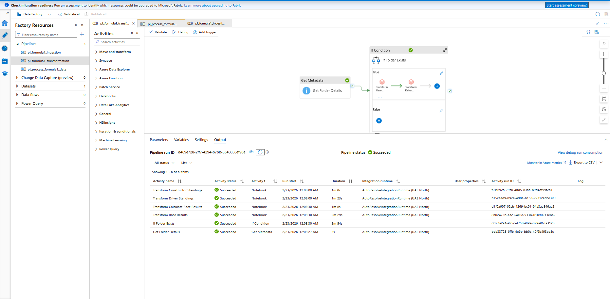
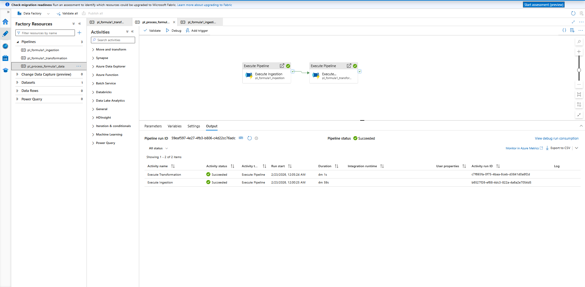
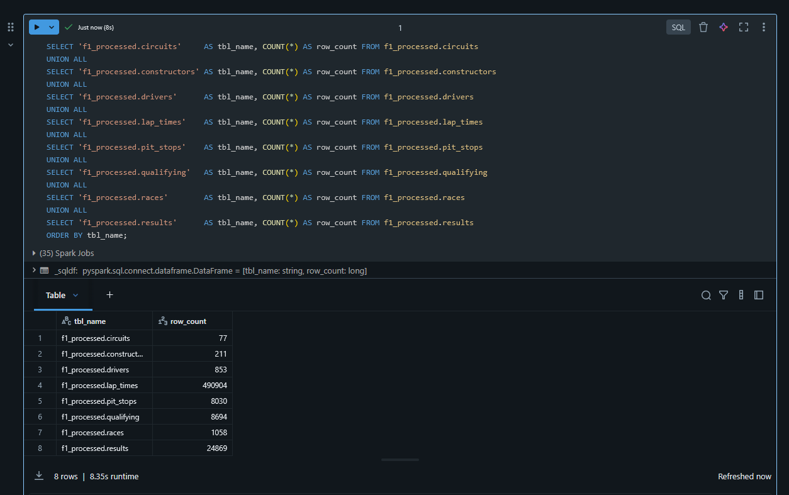
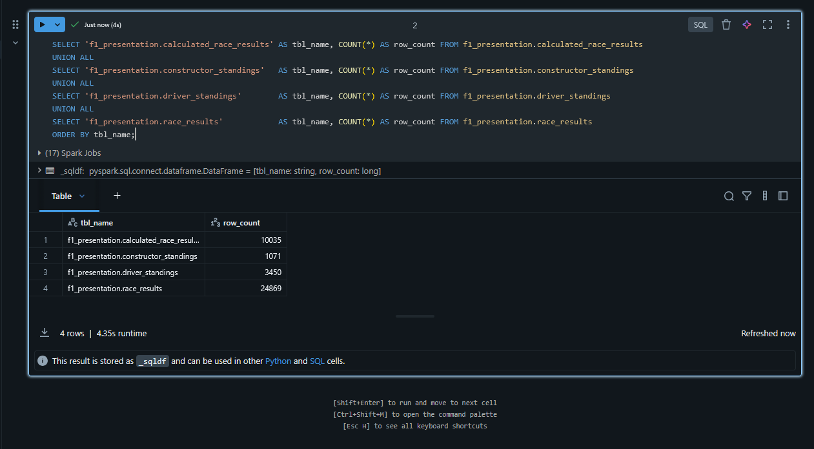
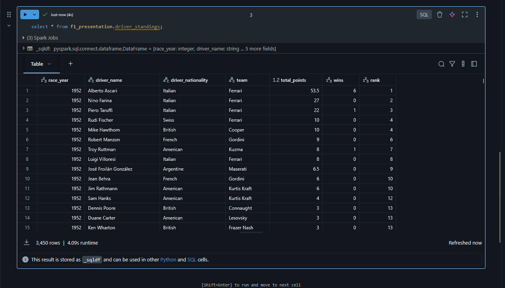
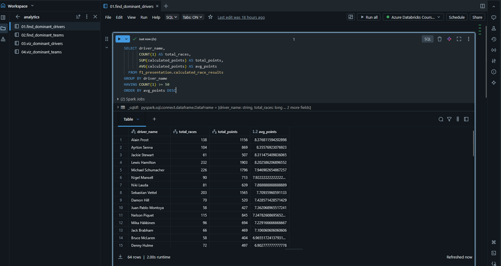

# Azure Databricks Formula 1 Analytics Pipeline

An end-to-end data engineering project that ingests Formula 1 race data, processes it through a layered architecture on Azure, and surfaces analytics-ready datasets — all built on Azure Databricks, PySpark, Delta Lake, and Azure Data Factory.

---

## What This Project Does

Formula 1 produces a rich dataset of races, drivers, constructors, lap times, pit stops, and qualifying sessions going back decades. This project uses a data extract originally sourced from the Ergast Motor Racing dataset and builds a complete analytics pipeline on Azure, transforming raw JSON and CSV files into clean, queryable tables that answer questions like:

- Who are the most dominant drivers of all time (and by decade)?
- Which constructors have been most consistently competitive?
- How do driver and constructor championship standings evolve across a season?

The pipeline follows a **medallion architecture** — raw data lands in a raw zone, gets cleaned and standardised in a processed zone, and is finally aggregated into a presentation zone for analysis.

---

## Architecture Overview

```
Ergast Data Extract (raw JSON/CSV)
        │
        ▼
┌─────────────────┐
│   Raw Layer     │  ADLS Gen2 — raw container
│  (as-is files)  │  CSV + JSON files
└────────┬────────┘
         │  Ingestion notebooks (PySpark)
         ▼
┌─────────────────┐
│ Processed Layer │  ADLS Gen2 — processed container
│ (cleaned data)  │  Parquet / Delta — f1_processed database
└────────┬────────┘
         │  Transformation notebooks (Spark SQL / PySpark)
         ▼
┌─────────────────┐
│Presentation Layer│  ADLS Gen2 — presentation container
│ (analytics-ready)│  Parquet / Delta — f1_presentation database
└─────────────────┘
         │
         ▼
   Dashboards / SQL Analytics
```

---

## Tech Stack

| Layer | Technology |
|---|---|
| Cloud platform | Microsoft Azure |
| Storage | Azure Data Lake Storage Gen2 (ADLS Gen2) |
| Compute | Azure Databricks (Apache Spark) |
| Processing language | PySpark + Spark SQL |
| Table format | Delta Lake + Parquet |
| Orchestration | Azure Data Factory (ADF) |
| Secrets management | Azure Key Vault + Databricks Secret Scopes |
| Authentication | Azure Service Principal (OAuth 2.0) |
| Data source | Ergast Formula 1 data extract (CSV + JSON) |

---

## Data Source

All Formula 1 data comes from a static extract of the **Ergast Motor Racing dataset** — a community-maintained dataset covering historical F1 data from 1950 to the present. It includes circuits, races, drivers, constructors, results, lap times, pit stops, and qualifying sessions in CSV and JSON formats.

> **Note:** The Ergast API (http://ergast.com/mrd/) is no longer operational. The raw data files used in this project are based on an extract taken from the Ergast dataset while it was still available, and are included directly in the `data/` directory.

Sample data files for testing (full load and incremental snapshots) are included under the `data/` directory.

---

## Project Structure

```
azure-databricks-formula1-project/
│
├── setup/                        # ADLS connectivity and auth setup notebooks
│                                 # (access keys, SAS tokens, service principal, mounting)
│
├── etl/
│   ├── common/
│   │   ├── configuration.py      # ADLS container paths (raw, processed, presentation)
│   │   └── utils.py              # Shared helpers — ingestion date, partition handling
│   │
│   ├── ingestion/
│   │   ├── 00.ingest_all_files.py          # Orchestrator — triggers all ingestion notebooks
│   │   ├── 01.ingest_circuits_file.py
│   │   ├── 02.ingest_races_file.py
│   │   ├── 03.ingest_constructors_file.py
│   │   ├── 04.ingest_drivers_file.py
│   │   ├── 05.ingest_results_file.py
│   │   ├── 06.ingest_pit_stops_file.py
│   │   ├── 07.ingest_lap_times_file.py
│   │   └── 08.ingest_qualifying_file.py
│   │
│   └── trans/
│       ├── 01.race_results.py              # Joins all tables into a unified race results view
│       ├── 02.driver_standings.py          # Driver championship standings by year
│       └── 03.constructor_standings.py     # Constructor standings by year
│
├── ddl/
│   └── prepare_for_incremental.py  # Drops/recreates databases for incremental load setup
│
├── analytics/
│   ├── 01.find_dominant_drivers.sql
│   ├── 02.find_dominant_teams.sql
│   ├── 03.viz_dominant_drivers.sql
│   └── 04.viz_dominant_teams.sql
│
├── demo/
│   └── 06.sql_objects_demo.py      # Delta Lake table creation demos
│
└── data/
    ├── full_load_data/             # Complete F1 dataset (circuits, races, drivers, etc.)
    └── Incremental_load_data/      # Dated snapshots for testing incremental loads
        ├── 2021-03-21/
        ├── 2021-03-28/
        └── 2021-04-18/
```

---

## Ingestion Layer

Each ingestion notebook reads raw files from the ADLS raw container, enforces an explicit PySpark schema, applies standard transformations (column renaming, adding ingestion timestamp, tagging the data source), and writes the result as Parquet/Delta into the `f1_processed` database.

| Notebook | Source | Output table |
|---|---|---|
| `01.ingest_circuits_file.py` | `circuits.csv` | `f1_processed.circuits` |
| `02.ingest_races_file.py` | `races.csv` | `f1_processed.races` |
| `03.ingest_constructors_file.py` | `constructors.json` | `f1_processed.constructors` |
| `04.ingest_drivers_file.py` | `drivers.json` | `f1_processed.drivers` |
| `05.ingest_results_file.py` | `results.json` | `f1_processed.results` |
| `06.ingest_pit_stops_file.py` | `pit_stops.json` | `f1_processed.pit_stops` |
| `07.ingest_lap_times_file.py` | `lap_times/` | `f1_processed.lap_times` |
| `08.ingest_qualifying_file.py` | `qualifying/` | `f1_processed.qualifying` |

---

## Transformation Layer

The transformation notebooks in `etl/trans/` join the processed tables and produce aggregated, analytics-ready datasets in the `f1_presentation` database.

- **`race_results.py`** — Joins circuits, races, drivers, constructors, results, pit stops, and lap times into a single denormalised race results table.
- **`driver_standings.py`** — Aggregates race results to compute driver championship standings per season, including total points and race wins.
- **`constructor_standings.py`** — Same as above but grouped by constructor (team).

---

## Orchestration

The pipeline is orchestrated using **Azure Data Factory** with two pipelines that trigger Databricks notebooks via a linked service:

- **`pl_ingest_formula1_data`** — triggers all ingestion notebooks sequentially, passing the `file_date` parameter for incremental load targeting.
- **`pl_transform_formula1_data`** — runs the transformation notebooks in dependency order (race results → driver standings → constructor standings).

Both pipelines are scheduled and can be triggered manually or on a recurring basis.

### ADF Pipeline Run






---

## Incremental Load Support

The pipeline supports **incremental loading** using a `file_date` partition column. Instead of reprocessing all historical data on every run, each pipeline execution only processes the new batch of files identified by date. The `ddl/prepare_for_incremental.py` script handles the initial database setup for this pattern.

---

## Analytics

The `analytics/` folder contains Spark SQL queries used to derive insights from the presentation layer:

- **Dominant drivers** — Ranked by average points per race, overall and broken down by decade.
- **Dominant constructors** — Ranked by average points per race, with decade-level breakdowns.
- Visualisation variants of both queries for use in Databricks notebooks.

---

## Setup

### Prerequisites

- An Azure subscription with:
  - Azure Data Lake Storage Gen2 account (three containers: `raw`, `processed`, `presentation`)
  - Azure Databricks workspace
  - Azure Key Vault
  - Azure Data Factory (for orchestration)
- A Service Principal with Storage Blob Data Contributor access on the ADLS account
- Databricks secret scope (`formula1-scope`) configured with:
  - `formula1dl-svc-principal-client-id`
  - `formula1dl-svc-principal-client-secret`
  - `formula1dl-svc-pincipal-tenant-id`

### Getting Started

1. Clone this repository and upload the notebooks to your Databricks workspace.
2. Update `etl/common/configuration.py` with your ADLS storage account name and container paths.
3. Run the appropriate setup notebook from `setup/` to configure ADLS connectivity.
4. Upload the raw data files from `data/full_load_data/` to your ADLS raw container.
5. Run `etl/ingestion/00.ingest_all_files.py` to trigger the full ingestion pipeline.
6. Run the transformation notebooks in `etl/trans/` in order (01 → 02 → 03).
7. Query the `f1_presentation` database for analytics.

For incremental loads, run `ddl/prepare_for_incremental.py` first to set up the database structure, then use the dated snapshots in `data/Incremental_load_data/` to simulate new data arrivals.

---

## Sample Output

### Processed Layer Record Count (Databricks)



### Presentation Layer Record Count (Databricks)



### Driver standings (presentation layer)



### Dominant drivers analytics



---

## Acknowledgements

Race data is based on the Ergast Motor Racing dataset, a free and open Formula 1 historical dataset that covered races from 1950 onwards. The Ergast API is no longer operational, but the dataset itself lives on through community extracts and mirrors. Thanks to the original maintainers for their work over the years.
