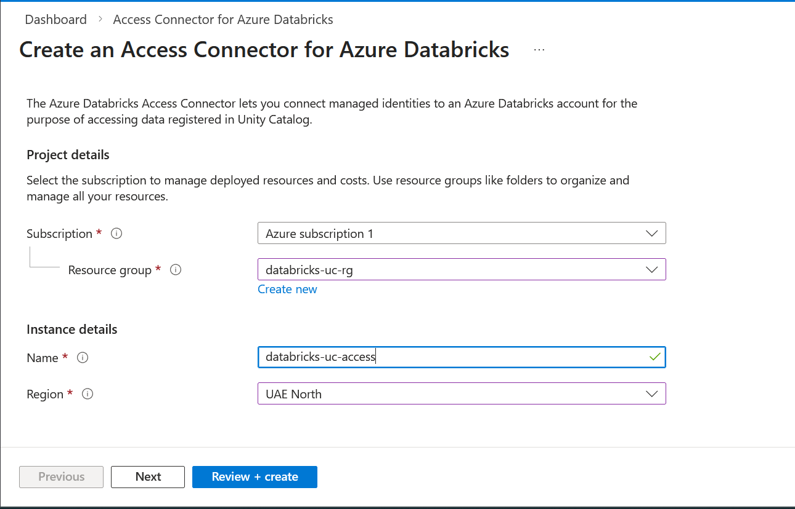
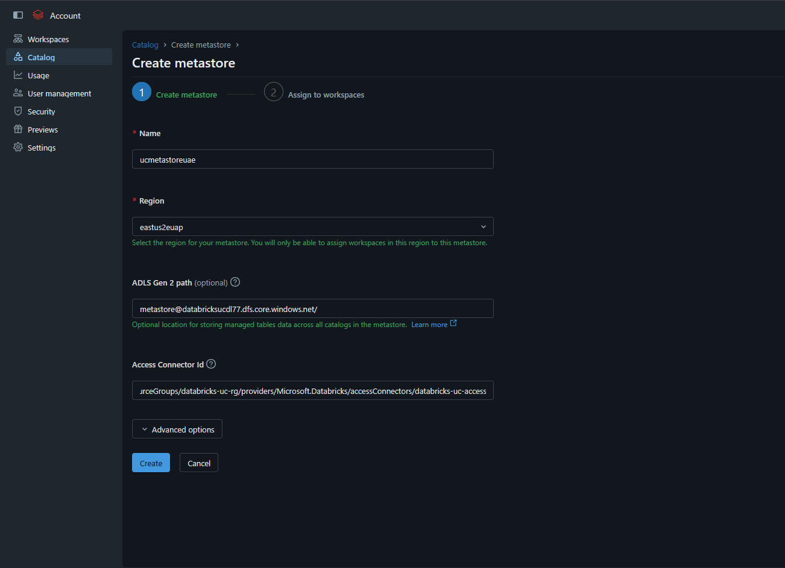

# Unity Catalog Setup

Unity Catalog is Databricks' centralised data governance solution. The steps below configure a Unity Catalog metastore backed by ADLS Gen2 and link it to your Databricks workspace.

---

## Prerequisites

- An Azure subscription with an existing ADLS Gen2 storage account
- Access to the Databricks account console (account-level admin)
- An Azure user with permissions to create resources and assign IAM roles

---

## Setup Steps

### 1. Create a dedicated ADLS Gen2 container

Create a new container in your ADLS Gen2 storage account from the Azure Portal. This container will serve as the backend storage for the Unity Catalog metastore.

---

### 2. Create an Access Connector for Azure Databricks

From the Azure Portal, search for and create a new **Access Connector for Azure Databricks**. This resource provisions a system-assigned managed identity that Databricks uses to authenticate with ADLS Gen2 without requiring explicit credentials.

---

### 3. Assign IAM role to the Access Connector

Navigate to the **IAM section** of the newly created container and assign the **Storage Blob Data Contributor** role to the Access Connector.

This grants Databricks read/write access to the metastore backend container.

Assign Below roles as well which are needed to add external location in Databricks in future:
- Storage Account Contributor
- EventGrid EventSubscription Contributor
- Storage Queue Data Contributor

---

### 4. Log in to the Databricks Account Console

Log in to the Databricks account console using your Azure user principal credentials:

- **URL:** https://accounts.azuredatabricks.net/
- **User principal name format:**
  - Internal tenant user: `<email>@<tenant>.onmicrosoft.com`
  - Guest/external user (invited via Azure B2B): `<email>#EXT#@<tenant>.onmicrosoft.com`

> This is account-level access, separate from your Databricks workspace login.

---

### 5. Create the Metastore

From the Databricks account console, go to **Catalog** and click **Create Metastore**. Fill in the following details:

| Field | Description |
|---|---|
| Name | A display name for the metastore |
| Region | Azure region — must match your Databricks workspace region |
| ADLS Gen2 Path | Path to the container created in Step 1 (e.g. `abfss://metastore@<storage-account>.dfs.core.windows.net/`) |
| Access Connector ID | Resource ID of the Access Connector created in Step 2 |

---

### 6. Assign the Workspace to the Metastore

Once the metastore is created, assign your Databricks workspace to it from the metastore settings. A workspace can only be assigned to one metastore at a time.

---

### 7. Create an Admins Group

In the Databricks account console, create an **Admins** group and add the user you will use to log in to the Databricks workspace portal.

---

### 8. Grant Metastore Admin Privilege to the Admins Group

In the metastore settings, grant the **Metastore Admin** privilege to the Admins group. This gives the group full administrative control over catalogs, schemas, tables, and permissions managed by Unity Catalog.

